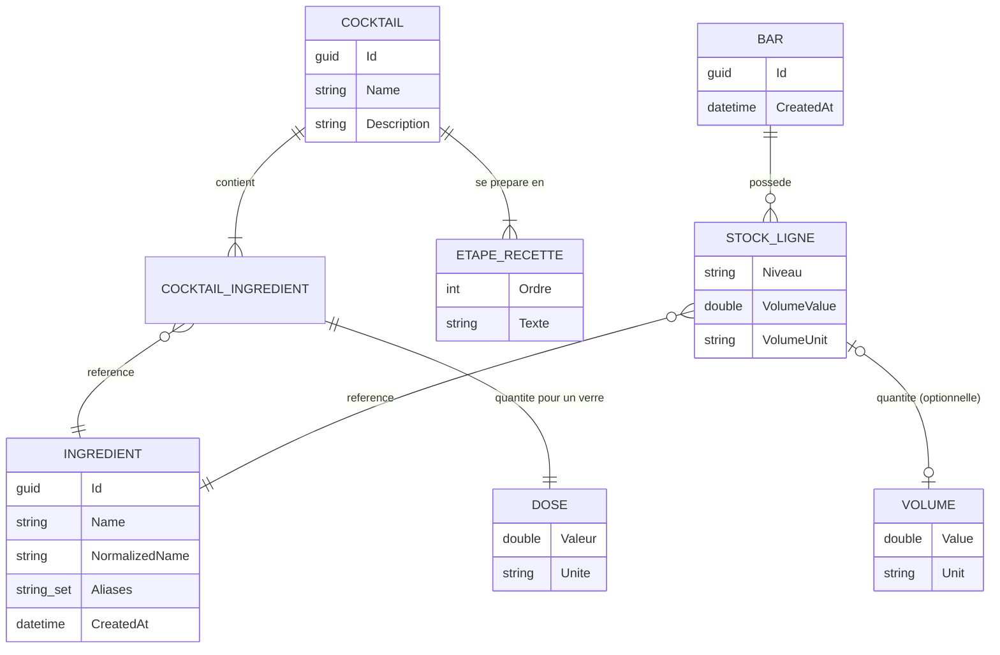
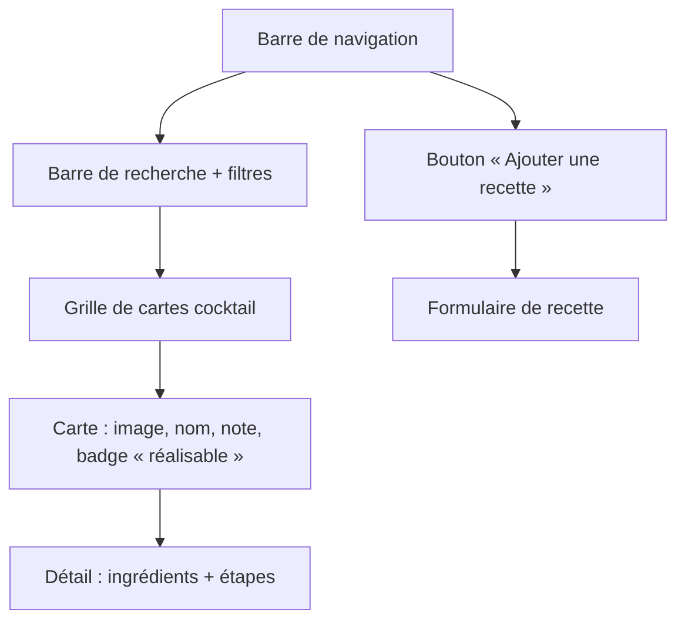

# MixoLogger — Cadrage MVP

> Bibliothèque de cocktails pour mixologues et amateurs de soirées.
> Document de référence : périmètre, stack, modèle de données, contrat d'API, décisions ouvertes.
>
> Dernière mise à jour : 2026-09-14

---

## 1. Objectifs

- **Cible** : 5 utilisateurs (l'auteur + 4 amis).
- **But** : partager, noter et découvrir des recettes de cocktails, et savoir **ce qu'on peut préparer avec ce qu'on a en stock**.
- **Contraintes** :
  - 100 % gratuit (auto-hébergement).
  - Pas de contrainte RGPD formelle (usage privé, entre proches) — ce qui ne dispense pas d'un minimum de sécurité, cf. §8.
  - Projet également support d'apprentissage (Clean Architecture / DDD côté back, Angular moderne à base de signals côté front).

### Cadre arrêté

| Sujet | Décision |
|-------|----------|
| **Hébergement** | **Serveur centralisé** — une instance unique, les 5 utilisateurs s'y connectent. Le déploiement lui-même est repoussé. |
| **Persistance** | **Repoussée.** On reste sur du stockage en mémoire tant que le besoin ne se fait pas sentir. |
| **Priorité immédiate** | **Un environnement de développement complet et fonctionnel** sur la stack cible. |
| **Stack** | Angular 22 + OptimusUI (composants complexes) / .NET 11 — cf. §2. |
| **CSS** | Intervention manuelle assumée par l'auteur ; OptimusUI sert surtout aux composants riches (tables, overlays, formulaires). |

### Fonctionnalités du MVP

| # | Fonctionnalité | Priorité | État |
|---|----------------|----------|------|
| F1 | Consulter la liste des cocktails | Must | ✅ Fait (données en mémoire) — branché sur l'API le 13/09/2026 : l'écran affichait jusque-là une liste codée en dur |
| F2 | Consulter le détail d'un cocktail (ingrédients + étapes) | Must | ✅ Fait — ingrédients (doses × nombre de verres) et étapes ordonnées |
| F3 | Gérer « Mon Bar » (stock d'ingrédients) | Must | ✅ Écran complet : ajout avec autocomplétion, niveau par ligne, retrait, volume exact optionnel |
| F4 | Savoir quels cocktails sont réalisables avec le stock | Must | ✅ Badge sur chaque carte (réalisable / ce qui manque), filtre « Seulement ce que je peux faire », tri réalisables d'abord |
| F5 | Ajouter / éditer une recette | Must | ✅ Création et édition (`/cocktails/new`, `/cocktails/:id/edit`), doses en volume ou en décompte. **Suppression reportée au lot C** (sans auteur, n'importe qui pourrait effacer la recette d'un autre) |
| F6 | Se connecter | Must | ✅ Connexion / déconnexion réelles, cookie de session HttpOnly, toute l'application protégée. Comptes en configuration hors dépôt (§10.2) |
| F7 | Noter un cocktail (⭐) | Should | ❌ Non modélisé |
| F8 | Recherche / filtres | Should | ❌ Non implémenté |
| F9 | Photo de cocktail | Could | ❌ Non traité (stockage non décidé) |
| F10 | Persistance des données entre deux redémarrages | Later | ⏸️ Volontairement repoussée — tout est en mémoire |

> ⚠️ Conséquence assumée de F10 : toute recette ajoutée et tout stock consommé disparaissent au
> redémarrage de l'API. Sur un serveur centralisé, cela veut dire que **le redémarrage efface les
> données de tout le monde d'un coup** — acceptable en phase de développement, à revoir avant
> d'ouvrir l'accès aux 4 autres utilisateurs. Pour limiter les dégâts entre-temps, garder le seed
> riche (§ `CocktailRepository.DEFAULT_COCKTAILS`) et isoler les repositories derrière leurs
> interfaces de `Domain/Interfaces/Repositories` : le passage à une vraie base ne devra toucher
> que `Infrastructure`.

---

## 2. Stack technique

### 2.1 Stack cible

| Composant | Cible | État du dépôt |
|-----------|-------|---------------|
| Frontend | **Angular 22** (standalone, signals, zoneless) | ✅ Angular 22.1, TypeScript 6.0 (A2) |
| Composants UI | **OptimusUI** (`@openng/optimus-ui` 2.x, MIT) | ✅ OptimusUI 2.0.2 + `@openng/icons` (A3) |
| CSS | Écrit à la main par l'auteur ; OptimusUI réservé aux composants complexes | — |
| Backend | **.NET 11** (préversion jusqu'au 10/11/2026) | ✅ `net11.0`, SDK épinglé par `global.json` (A1) |
| Médiateur | **MediatR 13** (CQRS : Commands / Queries) | ✅ En place |
| API | REST + Swagger / OpenAPI | ✅ En place |
| Persistance | **Aucune** (repositories `static` en mémoire) — choix assumé, cf. F10 | ✅ Conforme |
| Authentification | Cookie de session ASP.NET Core, sans Identity complet (§8) | ✅ F6 |
| Hébergement | Serveur centralisé — **repoussé** | ❌ Rien |

#### Notes sur les versions

- **Angular 22** — sorti le 3 juin 2026. Apports directement utiles ici : **Signal Forms** stables
  (le formulaire de recette F5 en est le cas d'usage type), **zoneless** par défaut, et **Angular
  Aria** pour les primitives accessibles. Le front est déjà en signals (`toggle-signal`,
  `UserService`) et déjà zoneless (`provideZonelessChangeDetection()` dans `app.config.ts`, qui
  devient redondant en v22) : la marche est courte. Les migrations automatiques de la v22 ont
  volontairement conservé le comportement antérieur : `ChangeDetectionStrategy.Eager` sur 5
  composants et `withXhr()` sur `provideHttpClient`. Passer à `OnPush` et au backend `fetch` est un
  choix à faire composant par composant, pas une obligation.
- **OptimusUI** — fork communautaire MIT de PrimeNG v21, créé après le passage de PrimeNG v22 sous
  licence commerciale (juin 2026). **API-compatible avec PrimeNG v21**, mêmes presets de thème
  (Aura, Material, Lara, Nora) via `@openng/optimus-ui-themes`. Les `peerDependencies` de la 2.0.2
  exigent `@angular/core ^22.1.4` : Angular 22 est donc un prérequis, pas une option.
- **.NET 11** — ⚠️ **pas encore GA.** Dernière préversion `11.0.0-preview.7` (11 août 2026), GA le
  **10 novembre 2026** (STS, supportée jusqu'au 09/11/2028). Travailler en préversion est
  acceptable ici parce que le déploiement est repoussé au-delà de la GA et que l'absence d'EF Core
  évite le principal point de friction des previews. **Épingler le SDK dans un `global.json`**
  (§10.1) pour éviter qu'une nouvelle preview change le comportement sans prévenir.

### 2.2 Reporté (à ne pas traiter maintenant)

| Sujet | Quand | Pourquoi c'est reporté sans risque |
|-------|-------|------------------------------------|
| PostgreSQL + EF Core + migrations | Quand la perte de données au redémarrage devient gênante | Les repositories sont déjà derrière des interfaces du `Domain` : seul `Infrastructure` changera |
| Docker / `docker-compose` | Avec le déploiement | Le dev tourne très bien en `dotnet run` + `npm start` |
| Déploiement sur le serveur centralisé | Après la GA de .NET 11 (novembre 2026) | Évite de déployer une préversion |
| HTTPS, reverse proxy, nom de domaine | Idem | — |

### 2.3 Architecture back

```
MixoLoggerBack/
├── Domain/          # Entités, value objects, interfaces de repositories — aucune dépendance
│   ├── Cocktails/   # Cocktail (aggregate), CocktailIngredient, Dose, Ingredient, EtapeRecette, Volume
│   ├── MyBar/       # Bar, LigneStock, Manque, Ustensils
│   ├── Utilisateurs/# Utilisateur (F6)
│   └── Units/       # VolumeConverter
├── Application/     # Use cases MediatR (Commands / Queries) + DTOs
├── Infrastructure/  # Repositories en mémoire, référentiel d'ingrédients, hachage des mots de passe
├── Web/             # Controllers, Program.cs, Swagger, sécurité (cookie, CORS, limitation)
├── Domain.Tests/    # Tests unitaires du domaine
└── Web.Tests/       # Tests d'intégration : API complète en mémoire (authentification)
```

Règle de dépendance : `Web → Application → Domain`, `Infrastructure → Domain`.
`Domain` ne dépend de rien.

### 2.4 Architecture front

```
MixoLoggerFront/src/app/
├── core/         # AuthService, UserService (état de session), gardes de session, ConfigService, http-interceptor
├── features/     # connexion/, cocktails/ (list, detail, edition, service, resolver, routes), mybar/
├── components/   # cocktail-card
├── models/       # types partagés
├── styles/       # customTheme.ts (preset de thème OptimusUI)
└── utils/        # toggle-signal, normaliser-nom, recherche-ingredients, libelle-dose
```

**Session côté front** : l'état (`UserService`) n'est qu'un reflet du cookie HttpOnly, illisible par le
JavaScript. Au démarrage, `GET /api/auth/moi` le restaure avant la première navigation ; le garde
`sessionRequise` renvoie vers `/connexion?retour=…` ; l'intercepteur envoie le cookie
(`withCredentials`) et renvoie vers la connexion sur tout `401` (session expirée).

L'URL de l'API est lue depuis `src/env/env.local.json` (`apiUrl`), chargée par `ConfigService`.

---

## 3. Modèle de données

### 3.1 Existant



- `Volume` est un **value object** (`record`) : valeur + unité (`mL`, `cL`, `dL`, `L`), avec conversion
  automatique en millilitres lors des opérations `+`, `-`, `*`, `<`, `>` (`Domain/Units/VolumeConverter.cs`).
- **`Ingredient` s'identifie par `NormalizedName`**, pas par `Id` : accents, casse et ponctuation sont
  neutralisés. Les `Aliases` ne participent pas à l'égalité (elle deviendrait non transitive) ; ils
  servent au référentiel à résoudre une saisie libre vers l'ingrédient canonique.
- **`LigneStock` a deux modes** : *possession simple* (`Volume` à `null`, seul le `Niveau` est connu —
  mode nominal du grand public) et *suivi précis* (un `Volume` décrémenté à chaque cocktail). Une ligne
  absente signifie « je n'ai pas cet ingrédient ». Cf. [STRATEGIE.md](STRATEGIE.md) §3.
- `UniteVolume` se sérialise en chaîne (`"mL"`) via `UniteVolumeConverter`.
- **`Dose`** (quantité dans une recette) est un volume (`mL`, `cL`, `dL`, `L`) **ou un décompte**
  (`piece`, `feuille`, `trait`, `pincee`). Seul un volume se compare au stock ; un décompte se vérifie
  par la **seule présence** de l'ingrédient dans le bar et ne retire rien au stock. La liste des unités
  existe côté API (`Dose.Unites`, exposée par `GET /api/cocktails/unites`) ; les libellés affichés
  (« feuille(s) ») sont côté front (`utils/libelle-dose.ts`).
- **`Cocktail` est immuable** : `Modifier()` renvoie une nouvelle instance de même `Id`, substituée
  d'un bloc par le dépôt. Règles : nom et étapes non vides, au moins un ingrédient et une étape, pas
  deux fois le même ingrédient (alias compris). L'unicité du nom de recette (sans accents ni casse) est
  vérifiée par l'application, sans atomicité — deux créations simultanées du même nom peuvent passer.

### 3.2 À ajouter pour couvrir les objectifs

Les objectifs mentionnent « noter » et « partager » : **ni l'un ni l'autre n'est modélisé**.

```
USER      { Id, Username, PasswordHash, DisplayName, CreatedAt }
RATING    { Id, CocktailId, UserId, Score (1-5), Comment?, CreatedAt }   -- unicité (CocktailId, UserId)
COCKTAIL  + AuthorId, CreatedAt, ImageUrl?
BAR       + OwnerId                                                      -- 1 bar par utilisateur
```

Décisions à trancher avant d'écrire les migrations : cf. §6.

---

## 4. Contrat d'API

Base : `http://localhost:5213/api` — Swagger UI sur `/swagger`.

### 4.1 Existant

| Verbe | Route | Corps | Retour | Notes |
|-------|-------|-------|--------|-------|
| `GET` | `/ping` | — | `"pong"` | Healthcheck |
| `GET` | `/api/cocktails` | — | `CocktailResumeDto[]` | `realisable` + `manques` (`ingredient`, `raison` : `Absent` \| `Insuffisant`) évalués contre le bar courant ; tri : réalisables, puis moins de manques, puis nom |
| `GET` | `/api/cocktails/{id}` | — | `CocktailDetailDto` | `ingredients` (`ingredientId`, `name`, `valeur`, `unite`) et `etapes` (`ordre`, `description`) ; `404` si absent |
| `GET` | `/api/cocktails/unites` | — | `string[]` | `mL`, `cL`, `dL`, `L`, `piece`, `feuille`, `trait`, `pincee` |
| `POST` | `/api/cocktails` | `RecetteSaisie` | `201` + `CocktailDetailDto` | `{ name, description?, ingredients: [{ name, valeur, unite }], etapes: string[] }` ; ingrédients par nom (alias compris, créés si inconnus **une fois la recette validée**) ; `400` contenu invalide, `409` nom déjà pris |
| `PUT` | `/api/cocktails/{id}` | `RecetteSaisie` | `CocktailDetailDto` | Remplace tout le contenu ; mêmes règles ; `404` si absent. Pas de contrôle de version : deux éditions simultanées gardent la dernière |
| `POST` | `/api/auth/connexion` | `{ identifiant, motDePasse }` | `UtilisateurDto` + cookie | **Anonyme.** `401` même réponse pour identifiant inconnu et mauvais mot de passe ; `429` au-delà de 5 essais par minute et par IP |
| `POST` | `/api/auth/deconnexion` | — | `204` | **Anonyme** (une session expirée doit pouvoir se fermer) |
| `GET` | `/api/auth/moi` | — | `UtilisateurDto` | `{ id, identifiant, nomAffiche }` ; `401` sans session |

> **Toute l'API exige une session** (politique d'autorisation par défaut), sauf ce qui est marqué
> *anonyme* ci-dessus et `/ping`. Un endpoint ajouté sans y penser est donc protégé, pas public.
> Sans session : `401` en `ProblemDetails`, jamais de redirection.
| `GET` | `/api/bars` | — | `MyBarDto` | Bar unique global |
| `GET` | `/api/ingredients` | — | `IngredientReferenceDto[]` | Référentiel trié par nom, alias normalisés inclus — alimente l'autocomplétion |
| `POST` | `/api/bars/MakeCocktails` | `CocktailBarOrder[]` | `MyBarDto` | Tout ou rien ; `409` si infaisable |
| `POST` | `/api/bars/ingredients` | `{ name, niveau?, quantity? }` | `MyBarDto` | `quantity` facultatif = possession simple ; `name` accepte un alias |
| `PATCH` | `/api/bars/ingredients/{name}` | `{ niveau }` | `MyBarDto` | `Pleine` \| `Entamee` \| `PresqueFinie` |
| `DELETE` | `/api/bars/ingredients/{name}` | — | `MyBarDto` | `404` si absent du bar |

> Le corps de `MakeCocktails` est un **tableau nu**, pas `{ "order": [...] }` : l'attribut `[FromBody]`
> posé sur la propriété `Order` de la commande lie le corps entier à cette propriété. Contre-intuitif,
> et directement lié à B8 (les attributs MVC n'ont rien à faire dans `Application`).

Les erreurs du domaine sont traduites en `ProblemDetails` (RFC 7807) par `Web/DomainExceptionHandler` :
`KeyNotFoundException` → 404, `ArgumentException` → 400, `InvalidOperationException` → 409. Le suffixe
technique « (Parameter 'xxx') » des `ArgumentException` est retiré du détail renvoyé, qui s'affiche tel
quel dans les formulaires.

### 4.2 À ajouter

| Verbe | Route | Objet |
|-------|-------|-------|
| `DELETE` | `/api/cocktails/{id}` | Supprimer une recette — avec le lot C, réservé à l'auteur |
| `POST` | `/api/cocktails/{id}/ratings` | Noter |

### 4.3 Conventions à adopter

- Retourner `ActionResult<T>` et les codes HTTP réels (`404`, `400`, `409`) plutôt que le type nu.
- Exposer des **DTOs**, jamais les entités de domaine (aujourd'hui `Cocktail` fuit tel quel, `Id`
  compris, et sa forme dicte le contrat).
- Format d'erreur unique : `ProblemDetails` (RFC 7807), déjà natif dans ASP.NET Core.

---

## 5. Design

### 5.1 Palette (thème sombre + violet)

| Couleur | Hex | Utilisation |
|---------|-----|-------------|
| Noir profond | `#0A0A0A` | Fond principal |
| Gris surface | `#1E1E1E` | Cartes, champs de saisie |
| Violet électrique | `#8A2BE2` | Boutons, accents, liens |
| Violet foncé | `#6A0DAD` | En-têtes, barre de navigation, hover |
| Gris clair | `#E0E0E0` | Texte secondaire, bordures |
| Blanc cassé | `#F5F5F5` | Texte principal |

**Mise en œuvre** : le thème passe par un preset (`src/app/styles/customTheme.ts`) qui surcharge la
palette `primary` d'Aura avec `{purple.*}`. Ces hex ne sont donc pas appliqués tels quels
aujourd'hui. Après la migration vers OptimusUI, le même fichier devient un `definePreset` importé
de `@openng/optimus-ui-themes` — l'API est identique à celle de PrimeNG v21.

**Thème sombre forcé** (depuis B14) : `darkModeSelector: '.app-dark'` dans `app.config.ts`, classe
`app-dark` posée sur `<html>`. L'application ne suit **pas** le réglage clair/sombre du poste. Pour
les styles écrits à la main, utiliser les variables `--mixo-fond`, `--mixo-surface`, `--mixo-accent`,
`--mixo-texte`, `--mixo-texte-secondaire`, `--mixo-bordure`, `--mixo-erreur` de `src/styles.scss`,
jamais de couleurs en dur. Pour vérifier un écran, le tester aussi avec le poste en mode clair : c'est
ce qui a révélé le défaut.

**Répartition assumée** : OptimusUI fournit les **composants complexes** (tables, overlays, dialogs,
selects, formulaires riches, toasts). Tout le reste — layout, cartes cocktail, typographie, palette —
est écrit en CSS/SCSS à la main. Concrètement : les composants maison (`cocktail-card`, grilles,
en-têtes) ne passent pas par la bibliothèque et appliquent directement la palette ci-dessus ; les
tokens du preset ne servent qu'à accorder les composants OptimusUI à cette palette.

**Accessibilité** : `#8A2BE2` sur `#0A0A0A` donne un ratio ≈ 3,6:1 — acceptable pour un gros titre
ou une bordure, **insuffisant pour du texte courant** (seuil AA : 4,5:1). Réserver le violet aux
accents et garder `#F5F5F5` pour le texte.

### 5.2 Polices

- Titres : [Poppins](https://fonts.google.com/specimen/Poppins) — Bold, 700
- Texte : [Inter](https://fonts.google.com/specimen/Inter) — Regular, 400

### 5.3 Écrans

| Écran | Route | État |
|-------|-------|------|
| Liste des cocktails | `/cocktails` | ✅ badges de faisabilité et filtre (F4) |
| Détail d'un cocktail | `/cocktails/:id` | ✅ ingrédients, étapes, nombre de verres, préparation |
| Mon Bar | `/my_bar` | ✅ gestion complète du stock (F3) |
| Ajout / édition de recette | `/cocktails/new`, `/cocktails/:id/edit` | ✅ (F5) |
| Connexion | `/connexion` | ✅ seule page accessible sans session (F6) |

Composants clés : `cocktail-card` (image, nom, note).

**Écran Mon Bar (F3)** — comportements retenus :

- **Ajout** : autocomplétion sur le référentiel (`GET /api/ingredients`), recherche insensible aux
  accents et à la casse, sur le nom *et* les alias (« scotch » propose Whisky) ; les ingrédients
  déjà présents ne sont pas reproposés. Une saisie libre inconnue est acceptée et crée l'ingrédient.
  Le niveau vaut « Pleine » par défaut ; le volume exact n'apparaît que si l'utilisateur active
  « Suivre le volume exact ».
- **Niveau** : modifiable directement sur chaque ligne.
- **Retrait** : immédiat en possession simple (rajouter ne coûte rien) ; **confirmation** si la ligne
  suit un volume, qui serait perdu.
- **État périmé** : un 409 (bar modifié entre-temps) ou un 404 (ligne déjà retirée ailleurs) recharge
  le bar et l'explique par un toast, au lieu de laisser agir sur des données fausses.
- La normalisation des noms existe en deux exemplaires (`IngredientName.Normalize` côté API,
  `normaliserNom` côté front) : **les garder alignés**, sinon la recherche ne retrouve plus les alias.
  La recherche elle-même est partagée avec l'écran de recette (`utils/recherche-ingredients.ts`).

**Écran de recette (F5)** — `/cocktails/new` et `/cocktails/:id/edit`, même composant :

- Accès : bouton « Ajouter une recette » sur la liste, « Modifier » sur le détail.
- Lignes d'ingrédients : autocomplétion (sans reproposer ceux des autres lignes), quantité, unité
  (volumes et décomptes). Un **doublon est signalé avant l'envoi**, alias compris (« rhum » puis
  « white rum »). Étapes : ajout, retrait, montée / descente.
- Les erreurs de saisie n'apparaissent qu'au premier envoi ou après passage dans le champ ; à l'envoi,
  le focus va au premier champ en erreur. Une erreur de l'API (nom déjà pris…) s'affiche dans un
  bandeau d'alerte **qui reçoit le focus**, le bouton d'envoi étant en bas de page.
- Après enregistrement : redirection vers le détail et toast. Un ingrédient saisi par alias apparaît
  sous son nom canonique (« angostura » devient « Bitters »).
- **Non traité** : aucune alerte si l'on quitte le formulaire avec des modifications non enregistrées.

Structure d'un écran de liste :



---

## 6. Décisions ouvertes

### 6.0 Tranché

**Hébergement : serveur centralisé, une instance unique.** Conséquences à intégrer dès maintenant,
même si le déploiement est repoussé :

- Le modèle **doit** porter la notion d'utilisateur (`User`, `Cocktail.AuthorId`, `Bar.OwnerId`) :
  une instance partagée sans propriétaire rend les objectifs « partager » et « noter » incohérents.
- L'API sera exposée à plusieurs clients ⇒ **authentification côté back obligatoire** (§8),
  et CORS restreint à l'origine du front (lève B4 et B7).
- Chaque requête doit pouvoir répondre à « qui appelle ? ». C'est le vrai prérequis technique,
  et il est indépendant de la persistance : on peut l'implémenter avec des utilisateurs en mémoire.
- **L'état en mémoire devient un état partagé par tous.** Les repositories `static` actuels
  fonctionnent par accident ; dès qu'il y a des écritures concurrentes, il faut des structures
  thread-safe (`ConcurrentDictionary`) ou un verrou. `CocktailRepository` importe déjà
  `System.Collections.Concurrent` sans l'utiliser.

### 6.1 Encore ouvert

Ces points ne bloquent pas la mise en place de l'environnement de développement, mais doivent être
tranchés avant d'écrire les fonctionnalités multi-utilisateurs (F5, F7).

2. **« Mon Bar » : un par personne ou un seul commun ?**
   Le code implémente aujourd'hui **un bar global unique** (`BarRepository.DefaultBar`, `static`).
   Un bar par utilisateur implique `Bar.OwnerId` et l'identification de l'appelant sur chaque requête.

3. **Les recettes sont-elles communes ?** Bibliothèque partagée (probable) vs privée par auteur.
   Si partagée : qui peut éditer ou supprimer la recette d'un autre ?

4. **Les notes sont-elles par utilisateur ?** Si oui : moyenne affichée + note personnelle.
   Sinon la fonctionnalité perd son sens à 5 personnes.

5. **Images** : upload de fichiers (→ stockage disque + service de fichiers statiques) ou simple
   URL saisie à la main ? La seconde suffit largement pour un MVP.

6. ~~**Unité de saisie**~~ ✅ **Tranché (F5)** : oui, les recettes acceptent des décomptes (`piece`,
   `feuille`, `trait`, `pincee`) vérifiés par simple présence dans le bar. Cf. `Dose` au §3.1.

---

## 7. Dette technique et anomalies identifiées

- **B1 — `Bar.CanMake()` renvoie toujours `false`.** ✅ **Corrigé.** L'identité d'`Ingredient` porte
  désormais sur son nom normalisé (`IngredientName.Normalize` — accents, casse, ponctuation), et
  `IngredientReferentiel` résout les alias vers l'ingrédient canonique (« rhum », « white rum » →
  « Rhum blanc »). Les seeds cocktails et bar passent par lui. Constat d'origine : `Ingredient` est une `class` sans surcharge de
  `Equals`/`GetHashCode`, et son constructeur génère un `Guid.NewGuid()`. La comparaison se fait donc
  par référence : l'`Ingredient("Rhum")` du cocktail et l'`Ingredient("Rhum")` du bar sont deux objets
  distincts, et le `Ingredients.TryGetValue(...)` de `Bar.CanMake` échoue systématiquement.
  → Identifier les ingrédients par nom normalisé (ou par `Id` issu d'un référentiel partagé) et
  implémenter l'égalité en conséquence.
- **B2 — Stockage en mémoire non thread-safe.** ✅ **Corrigé pour le bar.** `BarRepository.GetBar()`
  renvoie une copie (`Bar.Snapshot()`) : chaque requête travaille sur sa propre instance. `SaveAsync`
  applique un **contrôle de concurrence optimiste** (`Bar.Version`) et lève
  `ConflitDeConcurrenceException` (→ 409) si la version lue est périmée. Point vérifié par un tir de
  40 ajouts simultanés : sans ce contrôle, la copie seule faisait perdre **5 écritures sur 40 en silence**
  (40 réponses 200, 35 lignes enregistrées) ; avec, chaque 200 correspond à une ligne enregistrée et les
  requêtes perdantes reçoivent un 409 explicite. `CocktailRepository` était déjà sur `ConcurrentDictionary`.
  Le mécanisme de version se transposera tel quel en *row version* EF Core. Constat d'origine : l'absence de persistance est un choix assumé (F10),
  mais son implémentation ne l'est pas : `CocktailRepository` et `BarRepository` exposent des
  `List<T>` / `Dictionary<K,V>` `static`, partagés par toutes les requêtes du processus. Sur un
  serveur centralisé à plusieurs utilisateurs, la première écriture concurrente (ajout de recette,
  `MakeCocktail`) peut corrompre la collection ou lever une exception. → `ConcurrentDictionary`
  (déjà importé mais inutilisé dans `CocktailRepository`) ou un verrou explicite.
- **B3 — `Volume` compare valeur *et* unité.** ✅ **Corrigé**, mais **pas** par la normalisation en mL à
  la construction initialement envisagée : elle aurait fait afficher « 700 mL » pour une saisie de
  « 70 cL ». `Equals` / `GetHashCode` comparent désormais la valeur convertie en mL, arrondie au
  millionième (arrondi plutôt que tolérance, pour garder une égalité transitive et un hash cohérent).
  L'unité de saisie reste portée par l'instance. Constat d'origine : `Volume(100, mL) == Volume(10, cL)` vaut `false` alors
  que les deux volumes sont égaux. Les opérateurs `<` / `>` convertissent bien, mais pas l'égalité
  générée par le `record`.
- **B4 — CORS `AllowAnyOrigin` + aucune auth côté back.** ✅ **Corrigé (F6)** : CORS restreint aux
  origines de `Front:Origines` (par défaut `http://localhost:4200`), avec cookies ; authentification
  réelle et API entièrement protégée. Constat d'origine : acceptable en développement local, à
  restreindre dès que l'API est exposée hors de la machine.
- **B5 — Les controllers renvoient des types nus** (`Cocktail`, `bool`) : pas de 404, pas de 400,
  pas de message d'erreur exploitable côté front. ✅ **Corrigé** : `DomainExceptionHandler` produit des
  `ProblemDetails`, et plus aucun endpoint n'expose d'entité de domaine — `BarsController` renvoie des
  DTOs, `GET /api/cocktails` renvoie `CocktailResumeDto` (F4), `GET /api/cocktails/{id}` renvoie
  `CocktailDetailDto` (F5 ; le champ `etapeRecettes` est devenu `etapes` côté front). Seul
  `POST /api/cocktails` renvoie un `ActionResult<T>` (pour le `201 Created`) ; les autres actions
  renvoient le DTO nu, les erreurs passant par le gestionnaire d'exceptions.
- **B6 — Couverture de test partielle.** ✅ Résolu côté back : `Domain.Tests` existe et couvre `Bar`,
  `Cocktail`, `EtapeRecette`, `Volume` et `VolumeConverter` en xUnit. Depuis F6, `Web.Tests` fait tourner
  l'API complète en mémoire (`WebApplicationFactory`) et couvre l'authentification de bout en bout.
  Restent peu ou pas testés : les handlers `Application` hors authentification, et **tout le front**
  (Karma/Jasmine installé, aucun test réel).
- **B7 — Authentification factice.** ✅ **Corrigé (F6)** : l'identifiant et le mot de passe en dur du
  bundle front ont disparu avec la modale ; la vérification se fait côté API, mots de passe hachés.
- **B8 — Les projets bibliothèque utilisent `Microsoft.NET.Sdk.Web`.** `Domain`, `Application` et
  `Infrastructure` sont déclarés avec le SDK Web + `<OutputType>Library</OutputType>`, ce qui leur
  fait référencer tout le framework ASP.NET Core et génère des `Properties/launchSettings.json`
  inutiles. Corollaire plus gênant : `Application` s'appuie effectivement sur
  `Microsoft.AspNetCore.Mvc` (`GetCocktailByIdQuery`, `MakeCocktailCommand`) et sur les usings
  implicites du SDK Web (`IServiceCollection` dans `DependencyInjection.cs`) — une couche applicative
  ne devrait pas connaître le web. Le nettoyage (`Microsoft.NET.Sdk` + retrait des attributs MVC des
  commandes/queries) est un chantier à part entière, volontairement hors du lot A.
- **B9 — L'écran « Mon Bar » n'appelle jamais l'API.** ✅ **Corrigé** : `MyBarService` passe par
  `HttpClient` (`getMyBar`, `addIngredient`, `setNiveau`, `removeIngredient`), le mock et ses GUID
  invalides ont disparu. Constat d'origine : `MyBarService.getMyStock()` renvoie un tableau
  `INGREDIENTS` codé en dur via `of()` : aucun `HttpClient`, aucun appel à `GET /api/bars`. Le front
  et le back affichent donc deux stocks différents et sans rapport (le seed de `BarRepository` compte
  14 entrées, celui du front une trentaine). Le tableau F3 du §1 (« lecture seule ») est optimiste :
  l'écran est intégralement déconnecté. Corollaire : les `id` du mock **ne sont pas des GUID valides**
  (`a1b2c3d4-e5f6-7890-g1h2-i3j4k5l6m7n8` — `g`, `h`, `i`… ne sont pas hexadécimaux), ils lèveront à
  la première désérialisation côté back dès que l'écran sera branché.
- **B10 — Aucun chemin d'écriture pour le bar.** ✅ **Corrigé** : `IBarRepository.SaveAsync`, commandes
  d'ajout / correction de niveau / retrait, et les endpoints correspondants (§4.1). Constat d'origine :
  `IBarRepository` n'exposait que `GetBar()` : ni `Save`,
  ni `Update`. `MakeCocktailCommandHandler` porte un `// TODO: Update the bar in the repository` et
  ne « fonctionne » que parce qu'il mute en place l'instance `static DefaultBar` de `BarRepository`.
  Cet effet de bord disparaîtra au passage à une vraie persistance, et il n'existe par ailleurs
  aucune commande d'ajout / retrait / correction de stock — c'est-à-dire que F3 (« gérer Mon Bar »),
  fonctionnalité *Must*, n'a pas de back.
- **B11 — `MakeCocktailCommand` ignore `Quantity`.** ✅ **Corrigé** : `CommandeCocktail` porte la
  quantité et `Bar.CanMakeAll` cumule les besoins. Constat d'origine : `CocktailBarOrder` porte bien un
  `int Quantity`, mais le handler appelle `bar.MakeCocktail(cocktail)` une seule fois par ligne de
  commande : commander 3 mojitos n'en décompte qu'un.
- **B12 — `MakeCocktailCommand` consomme partiellement avant d'échouer.** ✅ **Corrigé** :
  `Bar.MakeCocktails` valide la totalité de la commande avant la moindre consommation, et lève sinon
  (traduit en 409 par `DomainExceptionHandler`). Constat d'origine : le handler bouclait sur les
  lignes en vérifiant `CanMake` puis en consommant *au fil de l'eau*. Si la 3ᵉ ligne est infaisable,
  les deux premières ont déjà été décomptées et la méthode renvoie `false` sans rien restaurer : le
  stock est faux et l'appelant croit que rien n'a eu lieu. → Valider l'intégralité de la commande
  (quantités comprises, cf. B11) avant toute consommation.
- **B13 — L'intercepteur HTTP posait des en-têtes erronés.** ✅ **Corrigé.** `Access-Control-Allow-Origin`
  était ajouté à chaque *requête* alors que c'est un en-tête de *réponse* (sans effet, sinon forcer un
  préflight CORS), et `Content-Type: application/json` était posé même sur les `GET` / `DELETE` sans corps.
- **B14 — Page de détail d'un cocktail illisible.** ✅ **Corrigé.** Symptôme : texte clair sur fond clair.
  **Cause réelle, plus large que cette page** : l'application n'était sombre *que si le poste était en
  mode sombre*. Le thème OptimusUI suivait `prefers-color-scheme` (`darkModeSelector: 'system'` par
  défaut) et aucun fond de page n'était défini. La page de détail imposait un fond clair (`#fafafa`) à un
  texte hérité du thème sombre ; et, à l'inverse, **l'écran Mon Bar (F3) devenait illisible sur un poste
  en mode clair** (texte `#F5F5F5` sur canevas blanc) — régression vérifiée en simulant le mode clair.
  Correctif : thème sombre forcé (`darkModeSelector: '.app-dark'`, classe posée sur `<html>`), fond et
  couleur de page explicites, palette du §5.1 centralisée en variables CSS `--mixo-*` dans
  `src/styles.scss`, page de détail restylée. Vérifié dans les deux modes système : liste, détail, Mon Bar.
  Au passage : `lang="fr"` sur `<html>` (il valait `en`, les lecteurs d'écran prononçaient le français
  à l'anglaise) et libellés accessibles sur les boutons « − » / « + » du nombre de verres.

---

## 8. Sécurité

« Pas de RGPD » ne veut pas dire « pas de sécurité ». ✅ **Mis en place avec F6** :

| Mesure | Mise en œuvre |
|--------|---------------|
| Mots de passe hachés | PBKDF2 via `PasswordHasher<T>` d'ASP.NET Core Identity, sans le reste d'Identity. Hachés au démarrage, jamais conservés en clair |
| Session | Cookie `mixo_session` : `HttpOnly` (hors de portée d'une faille XSS), `SameSite=Strict` (CSRF), `Secure` hors développement, 14 jours glissants. Pas de JWT, donc pas de rafraîchissement à gérer |
| Tout protégé par défaut | Politique d'autorisation de repli : un endpoint est privé sauf `[AllowAnonymous]` explicite |
| Comptes | Déclarés en configuration **hors dépôt**, pas d'inscription publique (§10.2). Configuration invalide (identifiant vide ou en double, mot de passe < 12 caractères) : l'API refuse de démarrer. Compte retiré : sa session est rejetée à la requête suivante |
| Énumération des comptes | Même message et même durée de réponse pour un identifiant inconnu et un mauvais mot de passe |
| Force brute | 5 tentatives de connexion par minute et par IP (`Securite:TentativesDeConnexionParMinute`), `429` au-delà |
| CORS | Restreint aux origines de `Front:Origines` |
| Redirection après connexion | Le paramètre `?retour=` n'accepte qu'un chemin interne (pas de `//site` ni d'URL absolue) |

**Avant tout déploiement**, reste à faire : HTTPS (le cookie `Secure` l'exige hors développement) et,
derrière un reverse proxy, la configuration des en-têtes transférés — sans elle, toutes les requêtes
semblent venir de la même IP et la limitation des tentatives bloque tout le monde à la fois.

**Limites connues** : les comptes ne sont pas persistés (modifier un mot de passe = changer la
configuration et redémarrer) ; pas de changement de mot de passe par l'utilisateur ; la limitation
des tentatives est par IP, pas par compte.

---

## 9. Feuille de route

### Lot A — Environnement de développement (priorité actuelle)

Branche : `chore/lot-a-stack-upgrade`.

| Étape | Contenu | État |
|-------|---------|------|
| **A0** | Installer le SDK .NET 11 preview et Node.js | ✅ Fait (cf. §10.1 pour le `PATH`) |
| **A1** | `global.json` épinglant le SDK .NET 11 preview + passage des 4 `.csproj` en `net11.0` | ✅ Fait, compile sans avertissement |
| **A2** | Montée Angular 20 → 21 → 22 | ✅ Fait — Angular 22.1 |
| **A3** | PrimeNG 20 → 21 → OptimusUI 1.x → OptimusUI 2.x | ✅ Fait — procédure réelle en §10.3 |
| **A4** | Projet de tests back (`Domain.Tests`) + premiers tests | ✅ Fait — 79 tests, aucun *skip* |
| **A5** | Vérification de bout en bout : API + front qui démarrent, écrans OK | ✅ Fait le 13/09/2026, cf. §10.4 |

**Lot A terminé.**

### Lot B — Corrections bloquantes

Branche : `feat/mon-bar`, rebasée sur le lot A.

| Étape | Contenu | Lève | État |
|-------|---------|------|------|
| **B‑1** | Égalité d'`Ingredient` (nom normalisé) + référentiel d'alias | B1 | ✅ |
| **B‑2** | Égalité de `Volume` en mL — *pas* par normalisation à la construction, cf. §7 | B3 | ✅ |
| **B‑3** | Copie du bar par requête + contrôle de concurrence optimiste | B2 | ✅ |
| **B‑4** | DTOs + `ActionResult<T>` + `ProblemDetails` | B5 | ✅ |

### Lot C — Multi-utilisateur (après §6.1)

| Étape | Contenu |
|-------|---------|
| **C1** | ~~Modèle `User` + auth back réelle + CORS restreint~~ ✅ livré avec F6 (cookie plutôt que JWT, cf. §8). `Utilisateur.Id` est dérivé de l'identifiant, donc stable d'un redémarrage à l'autre : prêt pour C2 |
| **C2** | `Bar.OwnerId` / `Cocktail.AuthorId` selon les réponses à §6.1 |
| **C3** | ~~Création / édition de recette (F5)~~ ✅ livrée avant le lot C. Reste à y ajouter l'auteur (`Cocktail.AuthorId`), la règle « seul l'auteur modifie » et la suppression. Formulaire en *Reactive Forms* et non en *Signal Forms* : les composants OptimusUI sont des `ControlValueAccessor`, et Mon Bar comme la connexion utilisent déjà les *Reactive Forms* |
| **C4** | Notes (F7) et recherche (F8) |
| **C5** | Images (F9) |

### Lot D — Reporté

Persistance (PostgreSQL + EF Core), Docker, déploiement sur le serveur centralisé. Cf. §2.2.

---

## 10. Environnement de développement

### 10.1 Prérequis

| Outil | Version | Installé |
|-------|---------|----------|
| SDK .NET | `11.0.100-preview.7.26381.103` | ✅ `C:\Program Files\dotnet` |
| Node.js | 24.20.0 (npm 11.19) | ✅ via **nvm-windows** |
| Angular CLI | 22.1 | Local au projet — `npx ng`, pas d'installation globale nécessaire |

> ⚠️ **Aucun des deux n'est dans le `PATH` de tous les terminaux.** `dotnet` est absent du `PATH` de
> Git Bash, et Node n'est accessible que via le dossier de version nvm
> (`%LOCALAPPDATA%\nvm\v24.20.0`). Symptôme typique : `npm start` échoue avec « "node" n'est pas
> reconnu » alors que `npm` lui-même a été trouvé. Corriger le `PATH` utilisateur (ou relancer
> `nvm use 24.20.0` dans un terminal administrateur) évite de préfixer chaque commande.

> ⚠️ **npm 11 bloque les scripts d'installation** de `esbuild`, `lmdb`, `@parcel/watcher` et
> `msgpackr-extract` (« install scripts not yet covered by allowScripts »). Le build fonctionne sans
> eux ; les autoriser relève d'une décision explicite (`npm install-scripts approve <paquet>`).

Le SDK est épinglé à la racine du dépôt par `global.json`, pour que les préversions successives ne
changent pas le comportement sans prévenir :

```json
{
  "sdk": {
    "version": "11.0.100-preview.7.26381.103",
    "rollForward": "latestPatch",
    "allowPrerelease": true
  }
}
```

> `allowPrerelease` est indispensable tant que .NET 11 n'est pas GA. Le 10/11/2026 : passer la
> version en `11.0.100` et retirer `allowPrerelease`.

### 10.2 Lancer

Backend — `http://localhost:5213`, Swagger sur `/swagger` :

```bash
dotnet run --project MixoLoggerBack/Web
```

Frontend — `http://localhost:4200` :

```bash
cd MixoLoggerFront && npm ci && npm start
```

L'URL de l'API consommée par le front se configure dans `MixoLoggerFront/src/env/env.local.json`
(`apiUrl`). Sur un serveur centralisé, ce fichier devra être surchargé par environnement.

#### Créer les comptes (F6)

**Sans compte configuré, personne ne peut se connecter** : l'API démarre, mais le signale dans son
journal (« Aucun compte configuré »). Les comptes ne sont **jamais** dans le dépôt.

En local, dans les *user-secrets* du projet `Web` (stockés dans le profil Windows, hors du dépôt).
Un compte = trois clés, numérotées à partir de 0 ; remplacer les valeurs d'exemple :

```bash
dotnet user-secrets set "Comptes:0:Identifiant" "identifiant-du-compte" --project MixoLoggerBack/Web
```

```bash
dotnet user-secrets set "Comptes:0:NomAffiche" "Nom affiché" --project MixoLoggerBack/Web
```

```bash
dotnet user-secrets set "Comptes:0:MotDePasse" "au-moins-12-caracteres" --project MixoLoggerBack/Web
```

Puis `Comptes:1:…` pour le compte suivant. Vérifier ce qui est déclaré :

```bash
dotnet user-secrets list --project MixoLoggerBack/Web
```

Sur le serveur, les mêmes clés en variables d'environnement, avec un double souligné comme séparateur :
`Comptes__0__Identifiant`, `Comptes__0__MotDePasse`… Redémarrer l'API après toute modification.

Règles vérifiées au démarrage, qui refuse de se lancer sinon : identifiant non vide et unique (casse et
accents ignorés), mot de passe d'au moins 12 caractères. `NomAffiche` est facultatif (l'identifiant sert
alors de nom).

Autres réglages, facultatifs : `Front:Origines` (origines autorisées par CORS, par défaut
`http://localhost:4200`) et `Securite:TentativesDeConnexionParMinute` (par défaut 5).

### 10.3 Migration PrimeNG → OptimusUI

✅ **Réalisée le 13/09/2026** (commits `3fb49e2`, `3180b66`, `e76f441`). La procédure envisagée
initialement était fausse ; voici celle qui a réellement fonctionné, et pourquoi.

**Le piège** : dans le paquet `@openng/optimus-ui@2.x`, le schematic `migrate-from-primeng` est
marqué *« Deprecated on this line, maintained only on release/1.x »*, et `ng add` y est réservé aux
projets **non** PrimeNG. Or OptimusUI 1.x exige Angular **21** et OptimusUI 2.x exige Angular
**22.1**. D'où un ordre imposé, à lire dans le paquet lui-même avant de lancer quoi que ce soit
(`npm pack @openng/optimus-ui@<version>` puis `schematics/collection.json`) :

```bash
npx ng update primeng@21
```

```bash
npm install @angular/cdk@~21.2.0
```

```bash
npm install @openng/optimus-ui@1.0.2
```

```bash
npx ng generate @openng/optimus-ui:migrate-from-primeng --skip-install
```

```bash
npm install
```

```bash
npx ng update @angular/core@22 @angular/cli@22 @angular/cdk@22 @openng/optimus-ui@2
```

La dernière commande doit rester **une seule passe** : Angular 22 et OptimusUI 2 ne sont
installables qu'ensemble.

Ce qu'il a fallu corriger à la main :

- **`provideAnimationsAsync()` cassait le build** dès PrimeNG 21 (« Could not resolve
  `@angular/animations/browser` ») : PrimeNG 21 — et OptimusUI après lui — anime via son propre
  paquet *motion* et n'installe plus `@angular/animations`. L'application n'utilisant aucune
  animation Angular, le provider a été retiré.
- **`@angular/cdk`** n'était pas installé alors que PrimeNG 21 l'exige en *peer dependency*.

Ce que le schematic a fait seul, et qui s'est vérifié juste :

- `primeng`, `primeicons`, `@primeuix/themes` → `@openng/optimus-ui`, `@openng/icons`,
  `@openng/optimus-ui-themes` ; imports réécrits ; `providePrimeNG` → `provideOptimus`.
- **`@openng/icons` conserve le préfixe `pi`** : les 5 icônes utilisées (`pi-star`, `pi-share-alt`,
  `pi-check`, `pi-eye`, `pi-eye-slash`) existent, aucun template n'a été modifié.

OptimusUI 2 ne fournit **aucune** migration depuis la 1.x (`migrations.json` vide) : la seule
vérification valable est à l'exécution (§10.4).

**Reste signalé** : `app.html` affiche un avatar de démonstration chargé depuis le CDN de
PrimeFaces (`primefaces.org/cdn/primeng/images/demo/...`). Préexistant, mais fragile et sans rapport
avec l'application.

### 10.4 Validation de bout en bout (A5)

✅ **Réalisée le 13/09/2026** sur `feat/mon-bar` rebasée sur le lot A.

| Contrôle | Résultat |
|----------|----------|
| `dotnet build` | ✅ 0 avertissement |
| `dotnet test` | ✅ 79 réussis, 0 échec, 0 *skip* |
| `npm ci` + `ng build` | ✅ |
| API et front démarrés ensemble | ✅ `:5213` et `:4200` |
| Liste des cocktails | ✅ Données du serveur (`GET /api/Cocktails`) |
| Détail → « Faire ce cocktail » × 3 verres | ✅ Rhum 700 → 550 mL (3 × 50 mL) |
| Écran Mon Bar | ✅ Reflète le stock serveur, niveaux et volumes |
| Commande impossible (Bloody Mary) | ✅ 409, message de l'API affiché, stock intact |
| Dialogue et formulaire de connexion (OptimusUI 2) | ✅ Saisie et soumission fonctionnelles |
| Console navigateur | ✅ Aucune erreur hormis le 409 attendu |
| Concurrence (40 ajouts simultanés, curl) | ✅ Chaque 200 correspond à une ligne enregistrée ; les autres reçoivent un 409 |

Anomalies connues, non bloquantes pour A5 : **B14** (page de détail illisible, texte clair sur fond
clair) et 15 vulnérabilités npm, **toutes dans l'outillage de développement** (Karma, serveur de
dev) — `npm audit --omit=dev` n'en trouve aucune.
