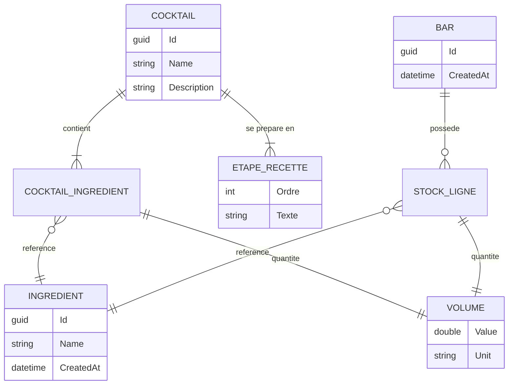
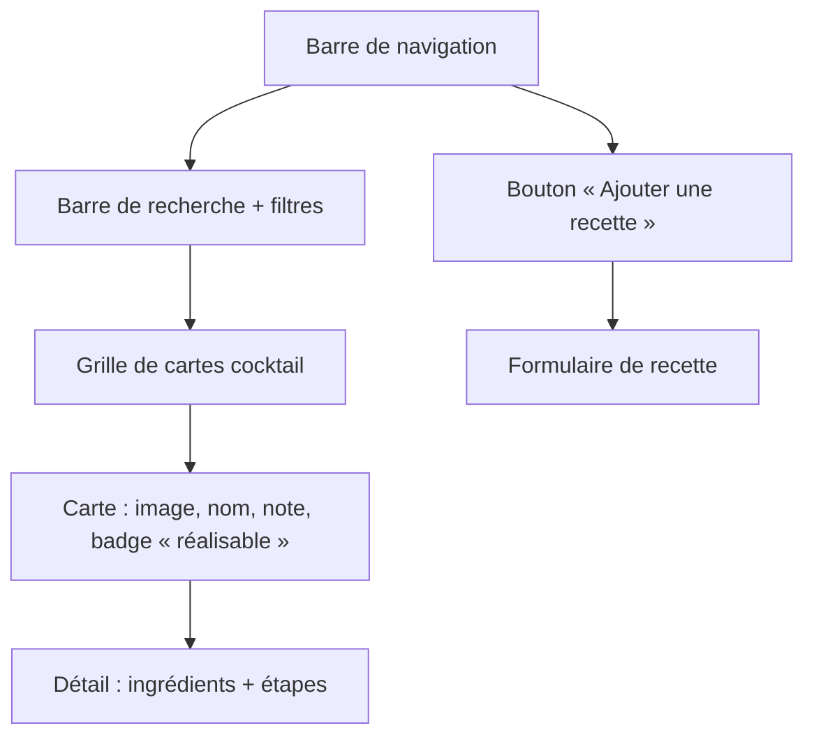

# MixoLogger — Cadrage MVP

> Bibliothèque de cocktails pour mixologues et amateurs de soirées.
> Document de référence : périmètre, stack, modèle de données, contrat d'API, décisions ouvertes.
>
> Dernière mise à jour : 2026-08-29

---

## 1. Objectifs

- **Cible** : 5 utilisateurs (l'auteur + 4 amis).
- **But** : partager, noter et découvrir des recettes de cocktails, et savoir **ce qu'on peut préparer avec ce qu'on a en stock**.
- **Contraintes** :
  - 100 % gratuit (auto-hébergement).
  - Pas de contrainte RGPD formelle (usage privé, entre proches) — ce qui ne dispense pas d'un minimum de sécurité, cf. §8.
  - Projet également support d'apprentissage (Clean Architecture / DDD côté back, Angular moderne à base de signals côté front).

### Cadre arrêté

| Sujet | Décision |
|-------|----------|
| **Hébergement** | **Serveur centralisé** — une instance unique, les 5 utilisateurs s'y connectent. Le déploiement lui-même est repoussé. |
| **Persistance** | **Repoussée.** On reste sur du stockage en mémoire tant que le besoin ne se fait pas sentir. |
| **Priorité immédiate** | **Un environnement de développement complet et fonctionnel** sur la stack cible. |
| **Stack** | Angular 22 + OptimusUI (composants complexes) / .NET 11 — cf. §2. |
| **CSS** | Intervention manuelle assumée par l'auteur ; OptimusUI sert surtout aux composants riches (tables, overlays, formulaires). |

### Fonctionnalités du MVP

| # | Fonctionnalité | Priorité | État |
|---|----------------|----------|------|
| F1 | Consulter la liste des cocktails | Must | ✅ Fait (données en mémoire) |
| F2 | Consulter le détail d'un cocktail (ingrédients + étapes) | Must | ✅ Fait |
| F3 | Gérer « Mon Bar » (stock d'ingrédients) | Must | 🟡 Lecture seule + « préparer » ; pas d'ajout/retrait |
| F4 | Savoir quels cocktails sont réalisables avec le stock | Must | 🟡 Implémenté mais non fonctionnel (cf. §7, bug B1) |
| F5 | Ajouter / éditer une recette | Must | ❌ `CreateCocktailCommand` existe, pas d'endpoint ni d'écran |
| F6 | Se connecter | Must | 🟡 Mock front uniquement (utilisateur en dur) |
| F7 | Noter un cocktail (⭐) | Should | ❌ Non modélisé |
| F8 | Recherche / filtres | Should | ❌ Non implémenté |
| F9 | Photo de cocktail | Could | ❌ Non traité (stockage non décidé) |
| F10 | Persistance des données entre deux redémarrages | Later | ⏸️ Volontairement repoussée — tout est en mémoire |

> ⚠️ Conséquence assumée de F10 : toute recette ajoutée et tout stock consommé disparaissent au
> redémarrage de l'API. Sur un serveur centralisé, cela veut dire que **le redémarrage efface les
> données de tout le monde d'un coup** — acceptable en phase de développement, à revoir avant
> d'ouvrir l'accès aux 4 autres utilisateurs. Pour limiter les dégâts entre-temps, garder le seed
> riche (§ `CocktailRepository.DEFAULT_COCKTAILS`) et isoler les repositories derrière leurs
> interfaces de `Domain/Interfaces/Repositories` : le passage à une vraie base ne devra toucher
> que `Infrastructure`.

---

## 2. Stack technique

### 2.1 Stack cible

| Composant | Cible | État du dépôt |
|-----------|-------|---------------|
| Frontend | **Angular 22** (standalone, signals, zoneless) | 🔺 Angular 20 — 2 majeures de retard |
| Composants UI | **OptimusUI** (`@openng/optimus-ui` 2.x, MIT) | 🔺 PrimeNG 20 — à migrer |
| CSS | Écrit à la main par l'auteur ; OptimusUI réservé aux composants complexes | — |
| Backend | **.NET 11** (préversion jusqu'au 10/11/2026) | 🔺 .NET 9 |
| Médiateur | **MediatR 13** (CQRS : Commands / Queries) | ✅ En place |
| API | REST + Swagger / OpenAPI | ✅ En place |
| Persistance | **Aucune** (repositories `static` en mémoire) — choix assumé, cf. F10 | ✅ Conforme |
| Authentification | À implémenter côté back (§8) | 🔺 Mock front en dur |
| Hébergement | Serveur centralisé — **repoussé** | ❌ Rien |

#### Notes sur les versions

- **Angular 22** — sorti le 3 juin 2026. Apports directement utiles ici : **Signal Forms** stables
  (le formulaire de recette F5 en est le cas d'usage type), **zoneless** par défaut, et **Angular
  Aria** pour les primitives accessibles. Le front est déjà en signals (`toggle-signal`,
  `UserService`) et déjà zoneless (`provideZonelessChangeDetection()` dans `app.config.ts`, qui
  devient redondant en v22) : la marche est courte.
- **OptimusUI** — fork communautaire MIT de PrimeNG v21, créé après le passage de PrimeNG v22 sous
  licence commerciale (juin 2026). **API-compatible avec PrimeNG v21**, mêmes presets de thème
  (Aura, Material, Lara, Nora) via `@openng/optimus-ui-themes`. Les `peerDependencies` de la 2.0.2
  exigent `@angular/core ^22.1.4` : Angular 22 est donc un prérequis, pas une option.
- **.NET 11** — ⚠️ **pas encore GA.** Dernière préversion `11.0.0-preview.7` (11 août 2026), GA le
  **10 novembre 2026** (STS, supportée jusqu'au 09/11/2028). Travailler en préversion est
  acceptable ici parce que le déploiement est repoussé au-delà de la GA et que l'absence d'EF Core
  évite le principal point de friction des previews. **Épingler le SDK dans un `global.json`**
  (§10.1) pour éviter qu'une nouvelle preview change le comportement sans prévenir.

### 2.2 Reporté (à ne pas traiter maintenant)

| Sujet | Quand | Pourquoi c'est reporté sans risque |
|-------|-------|------------------------------------|
| PostgreSQL + EF Core + migrations | Quand la perte de données au redémarrage devient gênante | Les repositories sont déjà derrière des interfaces du `Domain` : seul `Infrastructure` changera |
| Docker / `docker-compose` | Avec le déploiement | Le dev tourne très bien en `dotnet run` + `npm start` |
| Déploiement sur le serveur centralisé | Après la GA de .NET 11 (novembre 2026) | Évite de déployer une préversion |
| HTTPS, reverse proxy, nom de domaine | Idem | — |

### 2.3 Architecture back

```
MixoLoggerBack/
├── Domain/          # Entités, value objects, interfaces de repositories — aucune dépendance
│   ├── Cocktails/   # Cocktail (aggregate), CocktailIngredient, Ingredient, EtapeRecette, Volume
│   ├── MyBar/       # Bar, Ustensils
│   └── Units/       # VolumeConverter
├── Application/     # Use cases MediatR (Commands / Queries) + DTOs
├── Infrastructure/  # Implémentations des repositories (aujourd'hui : en mémoire)
└── Web/             # Controllers, Program.cs, Swagger, CORS
```

Règle de dépendance : `Web → Application → Domain`, `Infrastructure → Domain`.
`Domain` ne dépend de rien.

### 2.4 Architecture front

```
MixoLoggerFront/src/app/
├── core/         # AuthService, UserService, ConfigService, http-interceptor
├── features/     # cocktails/ (list, detail, service, resolver, routes), mybar/
├── components/   # cocktail-card, login-modal
├── models/       # types partagés
├── styles/       # customTheme.ts (preset de thème — PrimeNG aujourd'hui, OptimusUI après A3)
└── utils/        # toggle-signal
```

L'URL de l'API est lue depuis `src/env/env.local.json` (`apiUrl`), chargée par `ConfigService`.

---

## 3. Modèle de données

### 3.1 Existant



- `Volume` est un **value object** (`record`) : valeur + unité (`mL`, `cL`, `dL`, `L`), avec conversion
  automatique en millilitres lors des opérations `+`, `-`, `<`, `>` (`Domain/Units/VolumeConverter.cs`).
- `UniteVolume` se sérialise en chaîne (`"mL"`) via `UniteVolumeConverter`.

### 3.2 À ajouter pour couvrir les objectifs

Les objectifs mentionnent « noter » et « partager » : **ni l'un ni l'autre n'est modélisé**.

```
USER      { Id, Username, PasswordHash, DisplayName, CreatedAt }
RATING    { Id, CocktailId, UserId, Score (1-5), Comment?, CreatedAt }   -- unicité (CocktailId, UserId)
COCKTAIL  + AuthorId, CreatedAt, ImageUrl?
BAR       + OwnerId                                                      -- 1 bar par utilisateur
```

Décisions à trancher avant d'écrire les migrations : cf. §6.

---

## 4. Contrat d'API

Base : `http://localhost:5213/api` — Swagger UI sur `/swagger`.

### 4.1 Existant

| Verbe | Route | Corps | Retour | Notes |
|-------|-------|-------|--------|-------|
| `GET` | `/ping` | — | `"pong"` | Healthcheck |
| `GET` | `/api/cocktails` | — | `Cocktail[]` | ⚠️ renvoie l'entité de domaine, pas un DTO |
| `GET` | `/api/cocktails/{id}` | — | `Cocktail` | ⚠️ pas de 404 si absent |
| `GET` | `/api/bars` | — | `MyBarDto` | Bar unique global |
| `POST` | `/api/bars/MakeCocktails` | `MakeCocktailCommand` | `bool` | ⚠️ `bool` nu ; pas de raison d'échec |

### 4.2 À ajouter

| Verbe | Route | Objet |
|-------|-------|-------|
| `POST` | `/api/cocktails` | Créer une recette (`CreateCocktailCommand` existe déjà, non exposé) |
| `PUT` / `DELETE` | `/api/cocktails/{id}` | Éditer / supprimer |
| `POST` | `/api/bars/ingredients` | Ajouter du stock |
| `PATCH` | `/api/bars/ingredients/{id}` | Corriger une quantité |
| `GET` | `/api/cocktails?makeable=true` | Filtrer sur le stock |
| `POST` | `/api/cocktails/{id}/ratings` | Noter |
| `POST` | `/api/auth/login` | S'authentifier |

### 4.3 Conventions à adopter

- Retourner `ActionResult<T>` et les codes HTTP réels (`404`, `400`, `409`) plutôt que le type nu.
- Exposer des **DTOs**, jamais les entités de domaine (aujourd'hui `Cocktail` fuit tel quel, `Id`
  compris, et sa forme dicte le contrat).
- Format d'erreur unique : `ProblemDetails` (RFC 7807), déjà natif dans ASP.NET Core.

---

## 5. Design

### 5.1 Palette (thème sombre + violet)

| Couleur | Hex | Utilisation |
|---------|-----|-------------|
| Noir profond | `#0A0A0A` | Fond principal |
| Gris surface | `#1E1E1E` | Cartes, champs de saisie |
| Violet électrique | `#8A2BE2` | Boutons, accents, liens |
| Violet foncé | `#6A0DAD` | En-têtes, barre de navigation, hover |
| Gris clair | `#E0E0E0` | Texte secondaire, bordures |
| Blanc cassé | `#F5F5F5` | Texte principal |

**Mise en œuvre** : le thème passe par un preset (`src/app/styles/customTheme.ts`) qui surcharge la
palette `primary` d'Aura avec `{purple.*}`. Ces hex ne sont donc pas appliqués tels quels
aujourd'hui. Après la migration vers OptimusUI, le même fichier devient un `definePreset` importé
de `@openng/optimus-ui-themes` — l'API est identique à celle de PrimeNG v21.

**Répartition assumée** : OptimusUI fournit les **composants complexes** (tables, overlays, dialogs,
selects, formulaires riches, toasts). Tout le reste — layout, cartes cocktail, typographie, palette —
est écrit en CSS/SCSS à la main. Concrètement : les composants maison (`cocktail-card`, grilles,
en-têtes) ne passent pas par la bibliothèque et appliquent directement la palette ci-dessus ; les
tokens du preset ne servent qu'à accorder les composants OptimusUI à cette palette.

**Accessibilité** : `#8A2BE2` sur `#0A0A0A` donne un ratio ≈ 3,6:1 — acceptable pour un gros titre
ou une bordure, **insuffisant pour du texte courant** (seuil AA : 4,5:1). Réserver le violet aux
accents et garder `#F5F5F5` pour le texte.

### 5.2 Polices

- Titres : [Poppins](https://fonts.google.com/specimen/Poppins) — Bold, 700
- Texte : [Inter](https://fonts.google.com/specimen/Inter) — Regular, 400

### 5.3 Écrans

| Écran | Route | État |
|-------|-------|------|
| Liste des cocktails | `/cocktails` | ✅ |
| Détail d'un cocktail | `/cocktails/:id` | ✅ |
| Mon Bar | `/my_bar` | ✅ |
| Ajout / édition de recette | `/cocktails/new` | ❌ |
| Connexion | modale | 🟡 mock |

Composants clés : `cocktail-card` (image, nom, note), `login-modal`.

Structure d'un écran de liste :



---

## 6. Décisions ouvertes

### 6.0 Tranché

**Hébergement : serveur centralisé, une instance unique.** Conséquences à intégrer dès maintenant,
même si le déploiement est repoussé :

- Le modèle **doit** porter la notion d'utilisateur (`User`, `Cocktail.AuthorId`, `Bar.OwnerId`) :
  une instance partagée sans propriétaire rend les objectifs « partager » et « noter » incohérents.
- L'API sera exposée à plusieurs clients ⇒ **authentification côté back obligatoire** (§8),
  et CORS restreint à l'origine du front (lève B4 et B7).
- Chaque requête doit pouvoir répondre à « qui appelle ? ». C'est le vrai prérequis technique,
  et il est indépendant de la persistance : on peut l'implémenter avec des utilisateurs en mémoire.
- **L'état en mémoire devient un état partagé par tous.** Les repositories `static` actuels
  fonctionnent par accident ; dès qu'il y a des écritures concurrentes, il faut des structures
  thread-safe (`ConcurrentDictionary`) ou un verrou. `CocktailRepository` importe déjà
  `System.Collections.Concurrent` sans l'utiliser.

### 6.1 Encore ouvert

Ces points ne bloquent pas la mise en place de l'environnement de développement, mais doivent être
tranchés avant d'écrire les fonctionnalités multi-utilisateurs (F5, F7).

2. **« Mon Bar » : un par personne ou un seul commun ?**
   Le code implémente aujourd'hui **un bar global unique** (`BarRepository.DefaultBar`, `static`).
   Un bar par utilisateur implique `Bar.OwnerId` et l'identification de l'appelant sur chaque requête.

3. **Les recettes sont-elles communes ?** Bibliothèque partagée (probable) vs privée par auteur.
   Si partagée : qui peut éditer ou supprimer la recette d'un autre ?

4. **Les notes sont-elles par utilisateur ?** Si oui : moyenne affichée + note personnelle.
   Sinon la fonctionnalité perd son sens à 5 personnes.

5. **Images** : upload de fichiers (→ stockage disque + service de fichiers statiques) ou simple
   URL saisie à la main ? La seconde suffit largement pour un MVP.

6. **Unité de saisie** : le domaine gère mL/cL/dL/L, mais une recette contient aussi
   « 2 feuilles de menthe » ou « 1 trait d'angostura ». Faut-il un type de quantité non volumique ?

---

## 7. Dette technique et anomalies identifiées

- **B1 — `Bar.CanMake()` renvoie toujours `false`.** `Ingredient` est une `class` sans surcharge de
  `Equals`/`GetHashCode`, et son constructeur génère un `Guid.NewGuid()`. La comparaison se fait donc
  par référence : l'`Ingredient("Rhum")` du cocktail et l'`Ingredient("Rhum")` du bar sont deux objets
  distincts, et le `Ingredients.TryGetValue(...)` de `Bar.CanMake` échoue systématiquement.
  → Identifier les ingrédients par nom normalisé (ou par `Id` issu d'un référentiel partagé) et
  implémenter l'égalité en conséquence.
- **B2 — Stockage en mémoire non thread-safe.** L'absence de persistance est un choix assumé (F10),
  mais son implémentation ne l'est pas : `CocktailRepository` et `BarRepository` exposent des
  `List<T>` / `Dictionary<K,V>` `static`, partagés par toutes les requêtes du processus. Sur un
  serveur centralisé à plusieurs utilisateurs, la première écriture concurrente (ajout de recette,
  `MakeCocktail`) peut corrompre la collection ou lever une exception. → `ConcurrentDictionary`
  (déjà importé mais inutilisé dans `CocktailRepository`) ou un verrou explicite.
- **B3 — `Volume` compare valeur *et* unité.** `Volume(100, mL) == Volume(10, cL)` vaut `false` alors
  que les deux volumes sont égaux. Les opérateurs `<` / `>` convertissent bien, mais pas l'égalité
  générée par le `record`. Prévoir une normalisation en mL à la construction.
- **B4 — CORS `AllowAnyOrigin` + aucune auth côté back.** Acceptable en développement local,
  à restreindre dès que l'API est exposée hors de la machine.
- **B5 — Les controllers renvoient des types nus** (`Cocktail`, `bool`) : pas de 404, pas de 400,
  pas de message d'erreur exploitable côté front.
- **B6 — Couverture de test partielle.** ✅ Résolu côté back : `Domain.Tests` existe et couvre `Bar`,
  `Cocktail`, `EtapeRecette`, `Volume` et `VolumeConverter` en xUnit. Restent non testées les couches
  `Application` (handlers MediatR) et `Web`, ainsi que **tout le front** : Karma/Jasmine est installé
  sans aucun test réel.
- **B7 — Authentification factice.** `AuthService` compare à `Testboi` / `passBoi` en dur dans le
  bundle front. À remplacer avant toute exposition réseau.
- **B8 — Les projets bibliothèque utilisent `Microsoft.NET.Sdk.Web`.** `Domain`, `Application` et
  `Infrastructure` sont déclarés avec le SDK Web + `<OutputType>Library</OutputType>`, ce qui leur
  fait référencer tout le framework ASP.NET Core et génère des `Properties/launchSettings.json`
  inutiles. Corollaire plus gênant : `Application` s'appuie effectivement sur
  `Microsoft.AspNetCore.Mvc` (`GetCocktailByIdQuery`, `MakeCocktailCommand`) et sur les usings
  implicites du SDK Web (`IServiceCollection` dans `DependencyInjection.cs`) — une couche applicative
  ne devrait pas connaître le web. Le nettoyage (`Microsoft.NET.Sdk` + retrait des attributs MVC des
  commandes/queries) est un chantier à part entière, volontairement hors du lot A.
- **B9 — L'écran « Mon Bar » n'appelle jamais l'API.** `MyBarService.getMyStock()` renvoie un tableau
  `INGREDIENTS` codé en dur via `of()` : aucun `HttpClient`, aucun appel à `GET /api/bars`. Le front
  et le back affichent donc deux stocks différents et sans rapport (le seed de `BarRepository` compte
  14 entrées, celui du front une trentaine). Le tableau F3 du §1 (« lecture seule ») est optimiste :
  l'écran est intégralement déconnecté. Corollaire : les `id` du mock **ne sont pas des GUID valides**
  (`a1b2c3d4-e5f6-7890-g1h2-i3j4k5l6m7n8` — `g`, `h`, `i`… ne sont pas hexadécimaux), ils lèveront à
  la première désérialisation côté back dès que l'écran sera branché.
- **B10 — Aucun chemin d'écriture pour le bar.** `IBarRepository` n'expose que `GetBar()` : ni `Save`,
  ni `Update`. `MakeCocktailCommandHandler` porte un `// TODO: Update the bar in the repository` et
  ne « fonctionne » que parce qu'il mute en place l'instance `static DefaultBar` de `BarRepository`.
  Cet effet de bord disparaîtra au passage à une vraie persistance, et il n'existe par ailleurs
  aucune commande d'ajout / retrait / correction de stock — c'est-à-dire que F3 (« gérer Mon Bar »),
  fonctionnalité *Must*, n'a pas de back.
- **B11 — `MakeCocktailCommand` ignore `Quantity`.** `CocktailBarOrder` porte bien un
  `int Quantity`, mais le handler appelle `bar.MakeCocktail(cocktail)` une seule fois par ligne de
  commande : commander 3 mojitos n'en décompte qu'un.
- **B12 — `MakeCocktailCommand` consomme partiellement avant d'échouer.** Le handler boucle sur les
  lignes en vérifiant `CanMake` puis en consommant *au fil de l'eau*. Si la 3ᵉ ligne est infaisable,
  les deux premières ont déjà été décomptées et la méthode renvoie `false` sans rien restaurer : le
  stock est faux et l'appelant croit que rien n'a eu lieu. → Valider l'intégralité de la commande
  (quantités comprises, cf. B11) avant toute consommation.

---

## 8. Sécurité

« Pas de RGPD » ne veut pas dire « pas de sécurité ». Minimum pour un déploiement hors localhost :

- Mots de passe **hashés** (`PasswordHasher<T>` d'ASP.NET Core suffit ; Identity complet est
  surdimensionné pour 5 comptes créés à la main).
- Jeton JWT signé et court, avec refresh — ou cookie `HttpOnly` `SameSite=Strict` si front et API
  partagent le domaine.
- CORS restreint à l'origine du front.
- Comptes créés par l'administrateur (pas d'inscription publique) : à 5 utilisateurs, un seed suffit.

---

## 9. Feuille de route

### Lot A — Environnement de développement (priorité actuelle)

Branche : `chore/lot-a-stack-upgrade`.

| Étape | Contenu | État |
|-------|---------|------|
| **A0** | Installer le SDK .NET 11 preview et Node.js — **aucun des deux n'est présent sur la machine** (§10.1) | ❌ **Bloquant pour A2 à A5** |
| **A1** | `global.json` épinglant le SDK .NET 11 preview + passage des 4 `.csproj` en `net11.0` | ✅ Fait (non compilé) |
| **A2** | Montée Angular 20 → 21 → 22 (`ng update`, une majeure à la fois) | ⛔ Bloqué par A0 |
| **A3** | PrimeNG 20 → 21, puis migration vers OptimusUI (schematic, cf. §10.3) | ⛔ Bloqué par A0 |
| **A4** | Projet de tests back (`Domain.Tests`) + premiers tests | ✅ Écrit (non compilé, non exécuté) |
| **A5** | Vérification de bout en bout : API + front qui démarrent, écrans OK | ⛔ Bloqué par A0 |

> ⚠️ A1 et A4 ont été écrits **sans SDK disponible** : aucun `dotnet build`, aucun `dotnet test`,
> aucun `npm install` n'a pu être lancé. Tout est donc à valider au premier build (§10.4).

### Lot B — Corrections bloquantes

| Étape | Contenu | Lève |
|-------|---------|------|
| **B‑1** | Égalité d'`Ingredient` (nom normalisé) + tests `CanMake` / `MakeCocktail` | B1 — la fonctionnalité cœur est morte aujourd'hui |
| **B‑2** | Normalisation de `Volume` en mL à la construction | B3 |
| **B‑3** | Repositories thread-safe (`ConcurrentDictionary`) | B2 — serveur partagé |
| **B‑4** | DTOs + `ActionResult<T>` + `ProblemDetails` | B5 |

### Lot C — Multi-utilisateur (après §6.1)

| Étape | Contenu |
|-------|---------|
| **C1** | Modèle `User` + auth back réelle (hash + JWT) + CORS restreint — lève B4 et B7 |
| **C2** | `Bar.OwnerId` / `Cocktail.AuthorId` selon les réponses à §6.1 |
| **C3** | Création / édition de recette (F5) — bon terrain pour les **Signal Forms** d'Angular 22 |
| **C4** | Notes (F7) et recherche (F8) |
| **C5** | Images (F9) |

### Lot D — Reporté

Persistance (PostgreSQL + EF Core), Docker, déploiement sur le serveur centralisé. Cf. §2.2.

---

## 10. Environnement de développement

### 10.1 Prérequis — ⚠️ rien n'est installé

Au 29/08/2026, la machine de développement ne contient **ni SDK .NET, ni Node.js** :
`C:\Program Files\dotnet` et `C:\Program Files\nodejs` n'existent pas, et le dépôt n'a jamais été
restauré (pas de `node_modules/`, pas de `obj/`). Aucune commande `dotnet` / `npm` / `ng` n'est donc
exécutable en l'état.

| Outil | Version attendue | Où |
|-------|------------------|-----|
| SDK .NET | `11.0.100-preview.7.26381.103` | <https://dotnet.microsoft.com/download/dotnet/11.0> |
| Node.js | LTS supportée par Angular 22 | <https://nodejs.org/> |
| Angular CLI | 22.x | `npm install -g @angular/cli@22` |

Le SDK est épinglé à la racine du dépôt par `global.json`, pour que les préversions successives ne
changent pas le comportement sans prévenir :

```json
{
  "sdk": {
    "version": "11.0.100-preview.7.26381.103",
    "rollForward": "latestPatch",
    "allowPrerelease": true
  }
}
```

> `allowPrerelease` est indispensable tant que .NET 11 n'est pas GA. Le 10/11/2026 : passer la
> version en `11.0.100` et retirer `allowPrerelease`.

### 10.2 Lancer

Backend — `http://localhost:5213`, Swagger sur `/swagger` :

```bash
dotnet run --project MixoLoggerBack/Web
```

Frontend — `http://localhost:4200` :

```bash
cd MixoLoggerFront && npm install && npm start
```

L'URL de l'API consommée par le front se configure dans `MixoLoggerFront/src/env/env.local.json`
(`apiUrl`). Sur un serveur centralisé, ce fichier devra être surchargé par environnement.

### 10.3 Migration PrimeNG → OptimusUI

L'ordre compte : OptimusUI est API-compatible avec **PrimeNG v21**, pas avec la v20 installée.

```bash
cd MixoLoggerFront
ng update @angular/core@21 @angular/cli@21
ng update primeng@21
ng update @angular/core@22 @angular/cli@22
ng add @openng/optimus-ui
```

Le schematic `ng add` installe les paquets, choisit un preset de thème et câble `provideOptimus`.
Pour une base déjà en PrimeNG, un schematic dédié réécrit les imports et renomme l'API de config :

```bash
ng generate @openng/optimus-ui:migrate-from-primeng
```

> ⚠️ La documentation publique cite ce schematic sous la forme `@openng/optimus-ui@1:migrate-from-primeng`
> (paquet en v1) alors que la version courante est la 2.0.2. Vérifier le nom exact avant de lancer,
> et faire la migration sur une branche dédiée.

Points de contrôle après migration :

- `src/app/styles/customTheme.ts` : `definePreset` / `Aura` importés depuis
  `@openng/optimus-ui-themes` au lieu de `@primeuix/themes`.
- `src/app/app.config.ts` : `providePrimeNG` → `provideOptimus`.
- `primeicons` : vérifier si le paquet reste utilisé tel quel ou s'il a un équivalent `@openng`.

### 10.4 Première validation, une fois le SDK installé

Le lot A a été écrit sans compilateur ni runtime. À vérifier dans cet ordre, la première commande
qui échoue indiquant quoi corriger :

```bash
dotnet --list-sdks
```

```bash
dotnet restore MixoLoggerBack/mixo-logger.slnx
```

Points de rupture probables, par ordre de vraisemblance :

1. **`Microsoft.AspNetCore.OpenApi` en `11.0.0-preview.7.26381.103`** — la version a été alignée sur
   celle du runtime de la preview 7. Si le restore échoue en NU1102, remplacer par la version
   effectivement publiée pour la preview installée.
2. **Les paquets de test en version flottante `*`** (`Domain.Tests.csproj`). Le plus simple est de
   régénérer le csproj aux versions du jour :
   `dotnet new xunit -n Domain.Tests -o MixoLoggerBack/Domain.Tests --force`, puis remettre le
   `<ProjectReference Include="..\Domain\Domain.csproj" />`.
3. **`<OutputType>Exe</OutputType>` dans `Domain.Tests`** — requis par xUnit v3, à retirer si le
   template installé est xUnit v2.

```bash
dotnet build MixoLoggerBack/mixo-logger.slnx
```

```bash
dotnet test MixoLoggerBack/Domain.Tests
```

Résultat attendu : **suite verte**, avec 3 tests marqués *skipped* — deux pour B1 (`BarTests`) et un
pour B3 (`VolumeTests`). Ces skips sont volontaires : ils décrivent le comportement correct et
servent de critère d'acceptation aux étapes B‑1 et B‑2. Un test qui échoue au lieu d'être skippé
signale une erreur d'écriture des tests, pas une régression du domaine.

Puis le front (§10.3), et enfin les deux serveurs en parallèle (§10.2).
